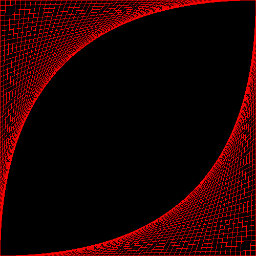
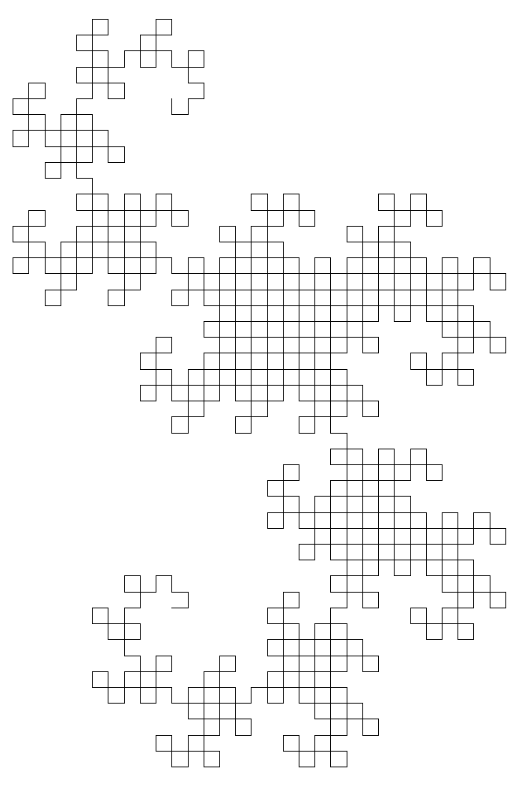
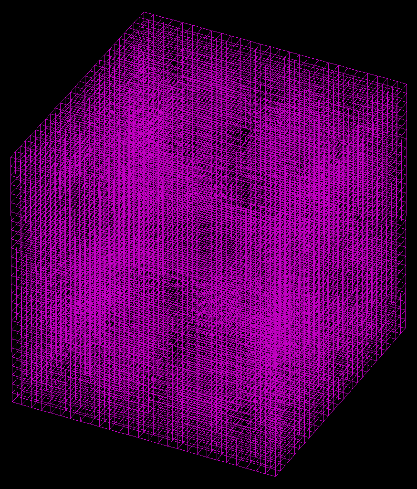
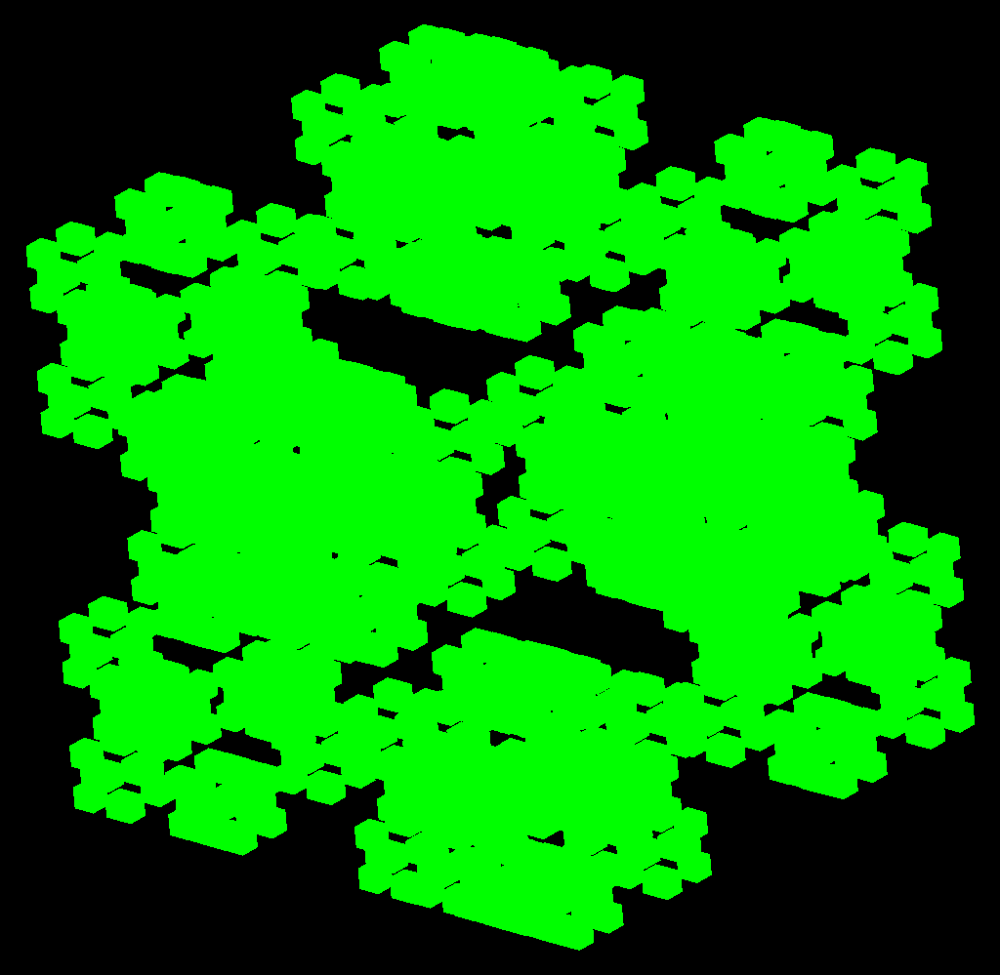

# ComputerGraphicsEngine

A C++ computer graphics engine that renders images from `.ini` scene description files.

It supports 2D intro patterns, 2D L-systems (deterministic and stochastic), 3D wireframes, Z-buffered wireframes, filled Z-buffering, and lighted Z-buffering. It can generate and transform common 3D figures (cube, tetrahedron, octahedron, icosahedron, dodecahedron, sphere, cylinder, cone, torus, buckyball) as well as fractal variants of them (fractal Platonic solids, Menger sponge).

## Gallery

| Intro lines (`ini/intro`) | Dragon curve L-system (`ini/l_systems`) |
| :---: | :---: |
|  |  |

| Menger sponge wireframe (`ini/3d_fractals`) | Z-buffered fractal (`ini/3d_fractals`) |
| :---: | :---: |
|  |  |

## Features

- **2D rendering**
  - Intro patterns: color rectangles, checkerboard blocks, and line-based figures (quarter circle, eye, diamond)
  - 2D L-systems with deterministic and stochastic replacement rules (`.L2D` input files)
- **3D rendering**
  - Wireframes
  - Z-buffered wireframes
  - Filled Z-buffering
  - Lighted Z-buffering (ambient, diffuse, specular)
- **Figure generation**
  - Platonic solids, sphere, cylinder, cone, torus, buckyball
  - Fractals: fractal Platonic solids, fractal buckyball, Menger sponge
  - 3D L-systems (`.L3D` input files)
- **Output**: BMP images

## Build

Requires CMake and a C++17 compiler.

```bash
cmake -S . -B build
cmake --build build
```

Without CMake, a direct compile also works:

```bash
clang++ -std=c++17 -O2 -o engine src/*.cc src/*.cpp
```

## Run

The engine takes one or more `.ini` files and writes a `.bmp` next to each:

```bash
./engine path/to/scene.ini
```

Without arguments it reads a `filelist` file in the current directory and processes every `.ini` listed in it. Each scene directory under `ini/` ships with such a `filelist`, so rendering a whole set is:

```bash
cd ini/3d_fractals
/path/to/engine        # renders all 178 scenes in this folder
```

> **Note:** run the engine from inside the scene directory — `.ini` files reference their `.L2D` input files relative to the working directory.

## Example scenes (`ini/`)

| Directory | Scenes | Contents |
| --- | --- | --- |
| `ini/intro/` | 5 | 2D intro patterns: color rectangle, blocks, line figures |
| `ini/l_systems/` | 26 | 2D L-systems (Koch curves, dragon curve, Sierpinski, Hilbert, tree, …) |
| `ini/l_systems_stochast/` | 2 | 2D L-systems with stochastic replacement rules |
| `ini/3d_fractals/` | 178 | 3D fractals as wireframe, Z-buffered wireframe, and filled Z-buffering |

Each directory contains the `.ini` scene files, a `filelist`, any `.L2D` inputs, and an `expected/` folder with reference renders (PNG) to compare your output against. See [`ini/README.md`](ini/README.md) for the scene file format.

## Project structure

```text
src/                  engine implementation
  engine.cc             entry point + scene dispatch
  easy_image.*          BMP image writer
  ini_configuration.*   .ini parser
  l_parser.*            L-system (.L2D/.L3D) parser, incl. stochastic rules
  introduction.*        2D intro patterns
  Figure/Face/...       3D geometry primitives
  PlatonischeLichamen.* Platonic solid generation
  translations.*        3D transformations & eye-point projection
  Wireframes.*          wireframe rendering
  ZBuffer*/lighted*     z-buffered & lighted rendering
ini/                  example scenes + expected output (see above)
docs/images/          renders used in this README
```
